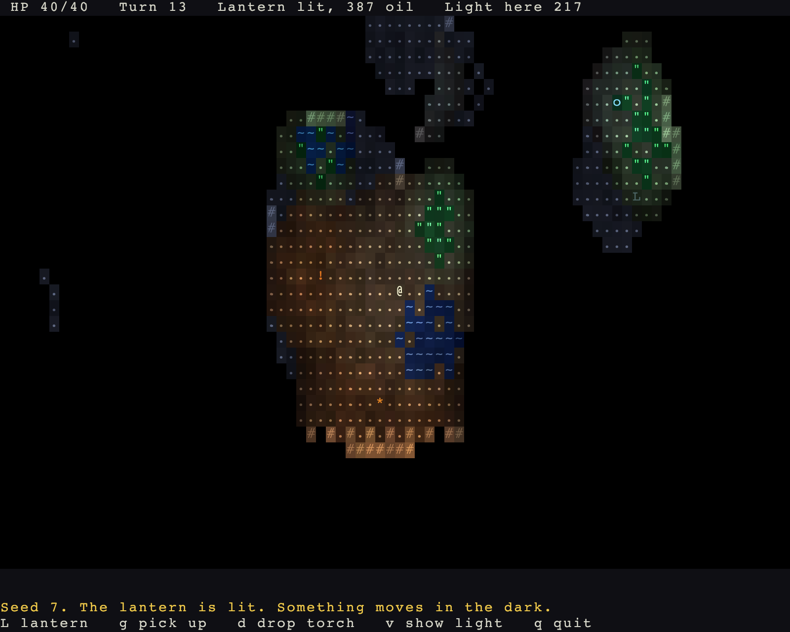

# rl-engine: a roguelike engine for Rust and Bevy

[](https://github.com/rudehn/rl-engine/actions/workflows/ci.yml)
[](#license)
[](https://www.rust-lang.org)
[](https://bevyengine.org)

**rl-engine** is an open source engine for turn-based, grid-based roguelike games, written in Rust on the Bevy game engine.
It gives you procedural dungeon and world generation, field of view, A* pathfinding, Dijkstra maps, monster AI, combat, items, quests and save games as small tested crates you depend on, not code you copy.
The core algorithms have no Bevy dependency, so map generation, pathfinding and game rules run headless, test in milliseconds and build for WebAssembly.


## Features

- **Procedural map generation**: a chain of seeded passes with rooms and corridors, BSP, cellular automata caves, doors, largest-region cleanup and ASCII prefabs.
- **Procedural world generation**: FBM noise, elevation, priority-flood hydrology with rivers and lakes, climate, site placement, road routing and seamless infinite chunk streaming.
- **Field of view**: symmetric shadowcasting over any `OpacitySource`, plus line of fire and targeting shapes for bolts, balls, beams and cones.
- **Pathfinding**: A* with reusable scratch buffers, region-bounded Dijkstra maps, flee maps and flow fields per movement profile.
- **Monster AI**: tactic-priority brains with hunt, melee, flee-when-hurt and wander, reading snapshots of what each actor can see.
- **A turn loop the engine owns**: an integer-clock energy scheduler, speed-scaled action costs and every due turn resolved inside one frame.
- **RPG rules**: stats and modifiers, a staged damage pipeline with resistances, status effects that tick by the turn, factions, equipment slots, affixes and enchantments.
- **Data-driven content**: tiles, monsters, items, statuses and quests are registries loaded from RON files, with weighted spawn tables by depth band.
- **Quests and events**: facts about what happened, named counters, and quests as objectives over those facts with prerequisites and a victory condition.
- **Save and load**: file, memory and browser storage backends, a versioned save schema and entity remapping.
- **Lighting**: point sources cast through the same shadows as sight, one component for props, actors and items, fuel that burns down, dark sight, and a viewshed cut to what is lit; opt-in per game, with ambient a value the game writes.
- **ASCII rendering and UI**: a diffed glyph grid renderer; a map view where every cell is its own shade of its tile, light colours the background as well as the glyph, flames flicker and water shimmers, and memory fades to a cold blue; a message log, a status line, menus and an overworld map screen; and a capture tool that plays keys and photographs the window.
- **Deterministic seeds**: one run seed, named random streams per domain and per pass, and no hash containers in gameplay code, so a seed replays the same map.
- **Balance tooling**: threat scoring and a spawn-band report you can run from the command line.

## Quick start

Clone the repository and run one of the three example games.

```sh
git clone https://github.com/rudehn/rl-engine
cd rl-engine
cargo run --release -p corsair -- --seed 7
cargo run --release -p delve -- --seed 7
cargo run --release -p lamplight -- --seed 7
```

The first build compiles Bevy and takes a few minutes.

## Use it in your game

rl-engine is not on crates.io yet, so depend on it from git.
The `rl-engine` crate is the facade that re-exports every other crate, and `rl_engine::prelude::*` brings in what a game reaches for, alongside `bevy::prelude::*`.

```toml
[dependencies]
rl-engine = { git = "https://github.com/rudehn/rl-engine" }
bevy = "0.19"
```

A game starts from `RoguelikePlugins`: a window sized to the glyph terminal, the engine's loop, sight, the map and the UI base.
Everything else is a plugin you name, so this is a game with combat and nothing it did not ask for.

```rust,no_run
use bevy::prelude::*;
use rl_engine::prelude::*;

App::new()
    .add_plugins(RoguelikePlugins::new("My roguelike", 80, 40))
    .add_plugins(CombatPlugin)
    .run();
```

A tool or a server that needs no window can depend on a single tier-1 crate, such as `rl-grid` for field of view and pathfinding, and never compile Bevy.

```toml
[dependencies]
rl-grid = { git = "https://github.com/rudehn/rl-engine" }
```

This builds a dungeon floor from a seed, computes what is visible from the start, and finds the path to the exit, all without Bevy.

```rust
use rl_engine::rl_core::RunSeed;
use rl_engine::rl_grid::{AStar, BitGrid, PathRules, TileRegistry, fov};
use rl_engine::rl_mapgen::dungeon::{ExitPoint, FarthestExit, RandomStart, Rooms};
use rl_engine::rl_mapgen::passes::StartPoint;
use rl_engine::rl_mapgen::{BaseContext, BuildContext, Chain};

// A 60 by 40 map of solid wall, with the standard wall and floor tiles.
let tiles = TileRegistry::standard();
let (wall, floor) = (tiles.expect("wall"), tiles.expect("floor"));
let mut map = BaseContext::blank(60, 40, tiles, wall);

// Carve rooms, place the start, and put the exit as far from it as possible.
// The same seed always builds the same floor.
Chain::new()
    .then(Rooms { floor, ..Default::default() })
    .then(RandomStart)
    .then(FarthestExit)
    .run(&mut map, RunSeed(7))
    .expect("a floor with rooms");
let start = map.outputs().first::<StartPoint>().unwrap().0;
let exit = map.outputs().first::<ExitPoint>().unwrap().0;

// Field of view from the start, and the cheapest walk to the exit.
let view = map.terrain().view(map.tiles());
let mut seen = BitGrid::new(60, 40);
fov::compute(&view, start, 8, &mut seen);
let path = AStar::new().find(&view, start, exit, PathRules::default()).expect("rooms connect");
println!("{} cells in sight, the exit is {} steps away", seen.count(), path.steps.len());
```

The four example games are the best guide to the Bevy side.
`examples/delve/src/floors.rs` is a complete multi-floor map builder in one file, and `examples/lamplight/src/main.rs` is lighting turned on in one file.

## Crates

The engine is a workspace of small crates in tiers.
Tiers 0 and 1 know nothing about Bevy and are what make generation, pathfinding and rules testable in milliseconds and benchmarkable without a window.
Tier 2 is the Bevy layer: plugins, the turn loop, rendering, UI.
Each crate declares its tier in its `Cargo.toml`, and `scripts/check-tiers.sh` fails the build if a tier-0 or tier-1 crate ever grows a Bevy dependency or any crate depends on a higher tier.

| Tier | Crate | What it holds |
|---|---|---|
| 0 | `rl-core` | grid, geometry, seeds and streams, dice, typed ids, the turn queue |
| 1 | `rl-grid` | tile registry, terrain, FOV, A*, Dijkstra maps, spatial index, regions |
| 1 | `rl-mapgen` | the pass pipeline and the builders that run in it |
| 1 | `rl-world` | world graph, hydrology, sites, roads, chunk generation |
| 1 | `rl-rules` | registries and banded tables from RON, stats, damage, statuses, factions, equipment, affixes, monster AI, facts and quests, balance scoring |
| 2 | `rl-bevy` | plugins, components, system sets, the turn loop, chunk streaming, items, places |
| 2 | `rl-render` | the glyph grid renderer and the world view |
| 2 | `rl-overworld` | opt-in overworld screen with a portal picker |
| 2 | `rl-save` | save backends, the versioned schema policy, entity remapping, the engine's state as a save |
| 2 | `rl-ui` | theme tokens, widgets, key hints, the log view |
| 3 | `rl-engine` | facade and prelude |

## Example games

### Corsair, an open-world roguelike

`examples/corsair` is a small pirate roguelike built only on the public API.
It has islands from the world graph, ports with huts, a bestiary and an armory in RON, factions and bump-to-attack combat.
Loot lies on the sand and in the pockets of the dead, with affixes and enchant levels from RON.
A pistol shoots along a clear line of fire, venom and bleeding tick by the turn, and rum cures them.
Smugglers' caves under the coves lead down to a treasure vault, and a ledger of tasks from RON ends in a victory.
A message log, a sea chest to equip from, and a world map with a portal picker round it out.
It is what a game on this engine looks like.

```sh
cargo run -p corsair -- --seed 7
cargo run -p corsair -- --continue   # resume the saved run
cargo run -p corsair -- --balance    # the spawn table's threat by band
```

Keys: arrows, `hjklyubn` or the numpad to walk, `.` to wait, `g` to pick up, `>` `<` or Enter to use a cave mouth or stairs, `f` to fire a pistol at the nearest foe, `i` for the sea chest, `t` for the ledger of tasks, `m` for the map, `S` to save, `q` to save and quit.

### The Hollow Whale, a dungeon delve


`examples/delve` is the Hollow Whale: five floors down a beached leviathan, mouth to heart, with no surface at all.
No world graph, no streaming, no overworld: each floor is a place built by a chain of engine passes the first time its stairs are taken, and the run is won when the heart warden dies.
Below the Maw the lights are off: the only light is the brand the player carries, the bile pooled on the floor, and what the bestiary says a beast sheds.
Two files; `floors.rs` is the whole map builder.

```sh
cargo run -p delve -- --seed 7
cargo run -p delve -- --seed 7 --floor 3    # start deeper
```

### Knacks, five genres of ability

`examples/knacks` is one arena and five sets of abilities: a fantasy caster, a pirate, a marine, a man-at-arms and a thief.
All eighteen load into one registry from five RON files that differ in nothing but their words, and `Tab` changes which set the player knows.
Nothing else about the run changes, because nothing else can: a fireball, a broadside and a smoke bomb are rows of the same table, fired by the same resolver, and mana, powder, power cells, stamina and nerve are one mechanism the engine cannot tell apart.
`src/effects.rs` holds the five effects the engine does not ship, one per genre, and is the honest half of the claim: everything else is data.

```sh
cargo run -p knacks -- --seed 7 --set pirates
```

Keys: walk as in the delve, `1` to `4` to aim an ability, `a` to list them with the reasons any cannot be used, `Tab` to change set, `.` to wait, `q` to quit.
While aiming, the direction keys step the cursor, `Tab` cycles what the ability wants, `Enter` or space fires, and `Esc` puts it away; an ability aimed at yourself fires at once.

### Lamplight, the lighting example



`examples/lamplight` is one dark cave and everything that glows in it: a lantern the player lights and douses that burns oil, a brazier that never moves, wisps that drift about with a glow of their own, a torch on the floor to pick up and drop, fungus and still water, and lurkers that see in the dark and are found only when a light reaches them.
One file, and the whole of turning lighting on is inserting the `Lighting` resource; one `LightSource` component serves the prop, the actors and the items.

```sh
cargo run -p lamplight -- --seed 7
```

Keys: walk as in the delve, `L` to light or douse the lantern, `g` to pick up, `d` to drop the torch, `v` to show light as digits, `.` to wait, `q` to quit.

### Pictures of your own

Any of the four photographs its own window when asked, after playing a script of keys through the real input, which is how the pictures above were made:

```sh
RL_CAPTURE=shot.png RL_CAPTURE_KEYS="j*4 l*6 ." cargo run -p lamplight -- --seed 7
```

The window opens above the others without taking focus, and the screen must be unlocked; a frame that comes back black is refused rather than saved.

## Design principles

- **Own the loop or leave it out.** A struct plus a `SystemSet` marker is not a subsystem.
- **No theme in the engine.** Content is an opaque id in a registry the game fills. No `#[non_exhaustive]` enums with a `Custom` variant, and no closed taxonomy enums.
- **Traits as parameters.** `impl Rng`, `impl CostSource`, `impl OpacitySource`, `impl Fn(Id) -> bool`. Asking the caller for a capability is how a Bevy dependency disappears.
- **Determinism within a build.** One `RunSeed`, named domains, per-pass streams, no hash containers in gameplay paths.
- **Measure the hot paths.** Every algorithm crate carries criterion benches on realistic maps.

## Documentation

- **[The guide](docs/guide/src/introduction.md)** builds a small roguelike in nine runnable steps, from a map on screen to an action of your own. Start here. Every step is a binary in `examples/tutorial`, so the code in the guide is code that compiles.
- `docs/OVERVIEW.md` is the inventory of what exists and what is not built yet, kept current.
- `docs/PLAN.md` is the design: what was decided, why, and which milestone each piece lands in.
- `docs/reviews/` holds the code reviews of the three repos the engine was extracted from, with `path:line` citations for every claim in the plan.
- `cargo doc --open -p rl-engine` builds the API reference; every public item is documented and every doc example runs as a test.

## Building and testing

```sh
cargo test -p rl-core -p rl-grid      # tier 0 and 1, seconds
cargo bench -p rl-grid                # FOV, A*, Dijkstra, regions
scripts/check-tiers.sh                # the tier boundaries
scripts/check-tiers.sh --wasm         # tiers 0 and 1 build for WebAssembly
scripts/check-guide.sh                # the guide's links into the code
mdbook serve docs/guide               # read the guide at localhost:3000
cargo test --workspace                # everything, builds Bevy
```

## Status

rl-engine is pre-1.0 and its API still moves.
Two complete example games run on it, and CI checks formatting, clippy, tests, docs and the WebAssembly build of every tier-1 crate.

## License

Licensed under either of [Apache License, Version 2.0](LICENSE-APACHE) or [MIT license](LICENSE-MIT) at your option.

Unless you explicitly state otherwise, any contribution intentionally submitted for inclusion in this project by you, as defined in the Apache-2.0 license, shall be dual licensed as above, without any additional terms or conditions.
