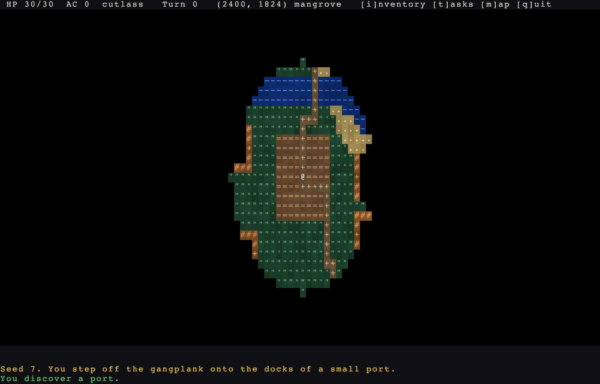
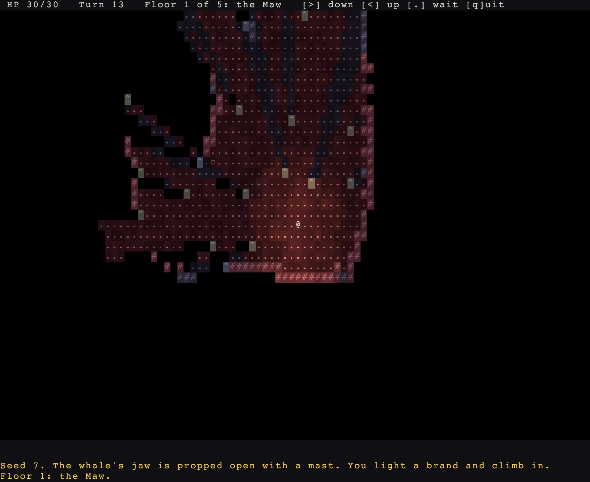

# rl-engine: a roguelike engine for Rust and Bevy

[](https://github.com/rudehn/rl-engine/actions/workflows/ci.yml)
[](#license)
[](https://www.rust-lang.org)
[](https://bevyengine.org)

**rl-engine** is an open source engine for turn-based, grid-based roguelike games, written in Rust on the Bevy game engine.
It gives you procedural dungeon and world generation, field of view, A* pathfinding, Dijkstra maps, monster AI, combat, items, quests and save games as small tested crates you depend on, not code you copy.
The core algorithms have no Bevy dependency, so map generation, pathfinding and game rules run headless, test in milliseconds and build for WebAssembly.



## Features

- **Procedural map generation**: a chain of seeded passes with rooms and corridors, BSP, cellular automata caves, doors, largest-region cleanup and ASCII prefabs.
- **Procedural world generation**: FBM noise, elevation, priority-flood hydrology with rivers and lakes, climate, site placement, road routing and seamless infinite chunk streaming.
- **Field of view**: symmetric shadowcasting over any `OpacitySource`, plus line of fire and targeting shapes for bolts, balls, beams and cones.
- **Pathfinding**: A* with reusable scratch buffers, region-bounded Dijkstra maps, flee maps and flow fields per movement profile.
- **Monster AI**: tactic-priority brains with hunt, melee, flee-when-hurt and wander, reading snapshots of what each actor can see.
- **A turn loop the engine owns**: an integer-clock energy scheduler, speed-scaled action costs and every due turn resolved inside one frame.
- **RPG rules**: stats and modifiers, a staged damage pipeline with resistances, status effects that tick by the turn, factions, equipment slots, affixes and enchantments.
- **Items that do things**: the ground, bags and slots with stacks and tags, one `Loadout` summed from what an actor is and wears so nothing is copied onto a wearer, gear that grants stats, triggers that say in RON what a thing does when it is used, lands, fires or hits, charges that are spent and can refill, and throwing with the flight the resolver and the preview both read.
- **Abilities and targeting**: what an actor can spend a turn on as data in RON, with costs against a pool, health or a tagged item, requirements over statuses, slots and stats, cooldowns on the turn clock, effects as types a game extends, and one cursor that previews through the call the resolver lands with.
- **Stealth and awareness**: a roll to notice by sight and light, memory of who has noticed whom, waking on a blow, and minds that act only on what they have noticed and search where they last saw it.
- **Noise and hearing**: every engine action makes its own sound, loudness spent walking through what a tile is made of, and a listener that hears a place rather than who made it and walks to it as a trail.
- **Fire and gas**: a value per tile stepped a turn at a time, gas whose kinds are a game's content and fire whose rules are the engine's, both writing into what stops sight and light.
- **Props and remains**: a crate, a lever or a console as content rather than a component and an action in every game, containers with a screen the engine runs end to end, and the dead left where they fell as the entity that died.
- **Data-driven content**: tiles, monsters, items, statuses and quests are registries loaded from RON files, with weighted spawn tables by depth band.
- **Quests and events**: facts about what happened, named counters, and quests as objectives over those facts with prerequisites and a victory condition.
- **Save and load**: file, memory and browser storage backends, a versioned save schema and entity remapping.
- **Lighting**: point sources cast through the same shadows as sight, one component for props, actors and items, fuel that burns down, dark sight, and a viewshed cut to what is lit; opt-in per game, with ambient a value the game writes.
- **ASCII rendering**: a diffed glyph grid renderer; a map view where every cell is its own shade of its tile, light colours the background as well as the glyph, flames flicker and water shimmers, and memory fades to a cold blue; animations played from what the turns cued, with the turns held so a bolt is seen to arrive before it hurts; and a capture tool that plays keys and photographs the window.
- **UI you can take apart**: thirteen panels, each a view of plain data, a collector that refills it and a presenter you may replace or drop, with colours named as roles in a palette rather than written into a widget, a narrator that says what a turn did through a phrasebook a game rewords, a controls screen built from the registry every key is declared in, and an overworld map screen.
- **Telling a run afterwards**: keys written down as they are played and pressed again against the clock they were read at, and a screen the run ends on with the outcome, the seed, the turn and whatever the game has to say about it.
- **Deterministic seeds**: one run seed, named random streams per domain and per pass, and no hash containers in gameplay code, so a seed replays the same map.
- **Balance tooling**: threat scoring and a spawn-band report you can run from the command line.

## Getting started

The quickest start is the template: one file that runs on the first build.

```sh
cargo install cargo-generate
cargo generate --git https://github.com/rudehn/rl-engine --tag v0.3.0 templates/starter --name my-game
cd my-game
cargo run
```

It plays from the first build. The one file holds a floor of rooms, a torch and braziers in the dark, goblins that notice you by sight and hunt where they last saw you, walking into one to strike it, a status row, a log, a look cursor, and three tests that play it without a window.
The guide below builds the same thing a step at a time.

The template pins the engine to the release named by `--tag`, and takes the template from that release too.
Leave the tag off and the template comes from `main`, which may use something no release has yet.
CI generates and builds the template on every change to the engine, so it does not rot.

## Follow the guide

The guide builds a small roguelike called Warren, six steps that each add one thing, and every step is playable in the browser without installing anything.

```sh
git clone https://github.com/rudehn/rl-engine
cd rl-engine
cargo run -p tutorial --bin step01_walking
```

Read it at [rudehn.github.io/rl-engine](https://rudehn.github.io/rl-engine/), or in [`docs/guide/src`](docs/guide/src), or run `mdbook serve docs/guide` for a local copy with search.

## Add it to a project you already have

rl-engine is not on crates.io yet, so depend on it from git.
The `rl-engine` crate is the facade that re-exports every other crate, and `rl_engine::prelude::*` brings in what a game reaches for, alongside `bevy::prelude::*`.

```toml
[dependencies]
rl-engine = { git = "https://github.com/rudehn/rl-engine", tag = "v0.3.0" }
bevy = "0.19"
```

A game starts from `RoguelikePlugins`: a window sized to the glyph terminal, the engine's loop, sight, the map and the UI base.
Everything else is a plugin you name, so this is a game with combat and nothing it did not ask for.

```rust,no_run
use bevy::prelude::*;
use rl_engine::prelude::*;

App::new()
    .add_plugins(RoguelikePlugins::new("My roguelike", 80, 40))
    .add_plugins((CombatPlugin, MindsPlugin))
    .run();
```

That compiles and opens a window, and then play refuses to begin until the game supplies a map, tile looks and a player, which the engine says at startup by listing everything missing at once.
The template is the smallest version that actually plays, and [the guide's first chapter](docs/guide/src/01-a-map-and-walking.md) writes it out line by line.

A tool or a server that needs no window can depend on a single tier-1 crate, such as `rl-grid` for field of view and pathfinding, and never compile Bevy.

```toml
[dependencies]
rl-grid = { git = "https://github.com/rudehn/rl-engine", tag = "v0.3.0" }
```

This builds a dungeon floor from a seed, computes what is visible from the start, and finds the path to the exit, all without Bevy.

```rust
use rl_engine::rl_core::RunSeed;
use rl_engine::rl_grid::{AStar, BitGrid, PathRules, TileRegistry, fov};
use rl_engine::rl_mapgen::dungeon::{ExitPoint, FarthestExit, RandomStart, Rooms};
use rl_engine::rl_mapgen::passes::StartPoint;
use rl_engine::rl_mapgen::{BaseContext, BuildContext, Chain};

// A 60 by 40 map of solid wall, with the standard wall and floor tiles.
let tiles = TileRegistry::standard();
let (wall, floor) = (tiles.expect("wall"), tiles.expect("floor"));
let mut map = BaseContext::blank(60, 40, tiles, wall);

// Carve rooms, place the start, and put the exit as far from it as possible.
// The same seed always builds the same floor.
Chain::new()
    .then(Rooms { floor, ..Default::default() })
    .then(RandomStart)
    .then(FarthestExit)
    .run(&mut map, RunSeed(7))
    .expect("a floor with rooms");
let start = map.outputs().first::<StartPoint>().unwrap().0;
let exit = map.outputs().first::<ExitPoint>().unwrap().0;

// Field of view from the start, and the cheapest walk to the exit.
let view = map.terrain().view(map.tiles());
let mut seen = BitGrid::new(60, 40);
fov::compute(&view, start, 8, &mut seen);
let path = AStar::new().find(&view, start, exit, PathRules::default()).expect("rooms connect");
println!("{} cells in sight, the exit is {} steps away", seen.count(), path.steps.len());
```

The three example games below are what to read once you know which subsystem you are looking for, and every mechanic the engine has is in one of them.
`examples/delve/src/floors.rs` is a complete multi-floor map builder in one file.

## If the build fails

On Linux, Bevy needs a few system packages that a Rust toolchain does not bring.
On Debian and Ubuntu:

```sh
sudo apt install pkg-config libasound2-dev libudev-dev libwayland-dev libxkbcommon-dev
```

## Crates

The engine is a workspace of small crates in tiers.
Tiers 0 and 1 know nothing about Bevy and are what make generation, pathfinding and rules testable in milliseconds and benchmarkable without a window.
Tier 2 is the Bevy layer: plugins, the turn loop, rendering, UI.
Each crate declares its tier in its `Cargo.toml`, and `scripts/check-tiers.sh` fails the build if a tier-0 or tier-1 crate ever grows a Bevy dependency or any crate depends on a higher tier.

| Tier | Crate | What it holds |
|---|---|---|
| 0 | `rl-core` | grid, geometry, seeds and streams, dice, typed ids, the turn queue |
| 1 | `rl-grid` | tile registry, terrain, FOV, A*, Dijkstra maps, spatial index, regions |
| 1 | `rl-mapgen` | the pass pipeline and the builders that run in it |
| 1 | `rl-world` | world graph, hydrology, sites, roads, chunk generation |
| 1 | `rl-rules` | registries and banded tables from RON, stats, damage, statuses, factions, equipment, affixes, monster AI, facts and quests, balance scoring |
| 2 | `rl-bevy` | plugins, components, system sets, the turn loop, chunk streaming, items, places |
| 2 | `rl-render` | the glyph grid renderer and the world view |
| 2 | `rl-overworld` | opt-in overworld screen with a portal picker |
| 2 | `rl-save` | save backends, the versioned schema policy, entity remapping, the engine's state as a save |
| 2 | `rl-ui` | theme tokens, widgets, key hints, the log view |
| 3 | `rl-engine` | facade and prelude |

## Example games

### Corsair, an open-world roguelike

`examples/corsair` is a small pirate roguelike built only on the public API.
It has islands from the world graph, ports with huts, a bestiary and an armory in RON, factions and bump-to-attack combat.
Loot lies on the sand and in the pockets of the dead, with affixes and enchant levels from RON.
A pistol shoots along a clear line of fire, venom and bleeding tick by the turn, and rum cures them.
Smugglers' caves under the coves lead down to a treasure vault, and a ledger of tasks from RON ends in a victory.
A broadside that spends powder, a grapnel that hauls a foe in, and a shakedown that spills a purse at a foe's feet are abilities in `assets/abilities.ron`, while a pull of rum is what the bottle itself does, in `assets/items.ron`; the last is the one effect Corsair adds to the engine's seven, in `src/abilities.rs`, and cutthroats throw the grapnel back.
In the caves the smugglers have to notice a quiet player instead of seeing it at once, and the rail down the right marks which of them has.
A message log, a sea chest to equip from, and a world map with a portal picker round it out.
A game on this engine looks like that.

```sh
cargo run -p corsair -- --seed 7
cargo run -p corsair -- --continue   # resume the saved run
cargo run -p corsair -- --balance    # the spawn table's threat by band
```

Keys: arrows, `hjklyubn` or the numpad to walk, `.` to wait, `g` to pick up, `e` to put on what is underfoot, `c` to shut a door, `>` `<` or Enter to use a cave mouth or stairs, `f` to aim the pistol, `r` to aim a throwing knife, `1` to `3` to aim a broadside, a grapnel or a shakedown, `u` in the sea chest to drink a bottle, `a` to list them, `x` to look, `tab` to pick out what is in sight, `p` for the ship's log, `i` for the sea chest, `t` for the ledger of tasks, `m` for the map, `@` for the ship's articles, Escape for the menu, `S` to save, `q` to save and quit, and `?` for all of them on one screen.

### The Hollow Whale, a dungeon delve



`examples/delve` is the Hollow Whale: five floors down a beached leviathan, mouth to heart, with no surface at all.
No world graph, no streaming, no overworld: each floor is a place built by a chain of engine passes the first time its stairs are taken, and the run is won when the heart warden dies.
Below the Maw the lights are off: the only light is the brand the player carries, the bile pooled on the floor, and what the bestiary says a beast sheds.
`floors.rs` is the whole map builder.

It is also where lighting, stealth and abilities meet.
The brand burns down, and smothering it slips you past a beast that has not yet noticed you; a whaler's torch lies on the first floor to pick up and set down, lit wherever it lies; whalers' lamps burn on every floor; and `v` shows the light on each tile as a digit.
The delver has five knacks in `assets/abilities.ron`: a fireball, a blink, a mend, a shield bash that asks the slot graph for the shield on its arm, and a drain that refills mana, the one effect the delve adds, in `src/effects.rs`.
Gut eels spit back.

```sh
cargo run -p delve -- --seed 7
cargo run -p delve -- --seed 7 --floor 3    # start deeper
```

Keys: arrows, `hjklyubn` or the numpad to walk, `.` to wait, `>` `<` or Enter for stairs, `1` to `5` to aim a knack, `a` to list them, `L` to smother or light the brand, `g` to pick up, `d` to set a torch or lamp down, `i` for the pack, `v` to show light, `x` to look, `tab` to pick out what is in sight, `c` for the character sheet, `p` for the log, Escape for the menu, `q` to quit, and `?` for all of them on one screen.

### The Counting House, a heist

`examples/heist` is three floors of a counting house after hours, and the engine's worked example of stealth and light.
You are a thief with a shaded lantern and a handful of pebbles, up from the cellars through the counting floor to the strongroom, and out of a window onto the roofs.
Whatever coin you carry out is the score; the watch carry cudgels and you carry a fist, so a fight is the thing that has gone wrong.

The play is in the dark, and the dark is made of engine seams.
Wall lamps are the only light: `s` snuffs the one beside you, which is where the watch cannot see you, and a watchman with hands walks over and lights it again.
That last is a `Sense` the game pushes onto the snapshot, a tactic of the game's own that reads it, and a `Choice` the engine routes to the game's own action.
`L` opens the lantern, which shows you the room and shows you to the room.
`t` throws a pebble, and every watcher in earshot enters the sound in its `Aware` and walks to look, until the pebble is forgotten.
A shut door stops sight and light, and a hound cannot open one.
A watchman who spots you shouts, and everyone in earshot comes.

```sh
cargo run -p heist -- --seed 7
```

Keys: arrows, `hjklyubn` or the numpad to walk, `.` to wait, `g` to pick up, `t` to throw a pebble, `s` to snuff a lamp, `c` to shut a door, `L` to open or shade the lantern, `>` `<` or Enter for stairs and for the window out, `v` to show light, `i` for your pockets, `x` to look, `tab` to pick out what is in sight, `p` for the log, Escape for the menu, `q` to quit, and `?` for all of them on one screen.

### Foundry, a fight down a droid foundry

`examples/foundry` is a commando fighting down ten decks of a droid foundry, and the engine's worked example of combat depth: weapons that run hot or run dry, droids that shoot and raise the alarm, radar that an ion hit blinds, and a reactor charge that ends in a choice of upgrade.
It is a library with a thin binary, so its own tests and a fingerprint tripwire play the same game the window does.

```sh
cargo run -p foundry -- --seed 7
FOUNDRY_START=3 cargo run -p foundry -- --seed 7   # start on the reactor deck, for a screenshot
```

Keys: arrows, `hjklyubn` or the numpad to walk, `.` to wait, `>` `<` or Enter for the lifts, `f` to fire, `t` to throw a blade, `g` to pick up, `e` to set a charge beside the console, `L` to switch the shoulder lamp off or on, `i` for the pack, `a` for abilities, `x` to look, `tab` to pick out what is in sight, Escape for the menu, and `?` for all of them on one screen.

### Abilities in any genre

Abilities being data that serves any genre is proved by a test, not a game: `crates/rl-bevy/tests/genres.rs` loads a fantasy caster, a pirate, a marine, a man-at-arms and a thief into one registry from five RON files that differ in nothing but their words, and builds all eighteen against one set of effects.

### Pictures of your own

Any of the games photographs its own window when asked, after playing a script of keys through the real input, which is how the pictures above were made:

```sh
RL_CAPTURE=shot.png RL_CAPTURE_KEYS="L j*4 l*6 ." cargo run -p delve -- --seed 7

# Write a run down as it is played, and play it back.
RL_RECORD=run.ron cargo run -p delve -- --seed 7
RL_REPLAY=run.ron cargo run -p delve
```

The window opens above the others without taking focus, and the screen must be unlocked; a frame that comes back black is refused rather than saved.

## Design principles

- **Own the loop or leave it out.** A struct plus a `SystemSet` marker is not a subsystem.
- **No theme in the engine.** Content is an opaque id in a registry the game fills. No `#[non_exhaustive]` enums with a `Custom` variant, and no closed taxonomy enums.
- **Traits as parameters.** `impl Rng`, `impl CostSource`, `impl OpacitySource`, `impl Fn(Id) -> bool`. Asking the caller for a capability is how a Bevy dependency disappears.
- **Determinism within a build.** One `RunSeed`, named domains, per-pass streams, no hash containers in gameplay paths.
- **Measure the hot paths.** Every algorithm crate carries criterion benches on realistic maps.

## Documentation

[**docs/**](docs/) is the index of all of it. The short version:

- **[The guide](docs/guide/src/introduction.md)** builds a small roguelike in nine runnable chapters, from a map on screen to an action of your own. Start here, at [rudehn.github.io/rl-engine](https://rudehn.github.io/rl-engine/) for the sidebar and the search. Every chapter is a binary in `examples/tutorial`, so the code in the guide is code that compiles.
- **[The systems reference](docs/guide/src/systems/)** is the same book's page per subsystem, checked against the code it documents: what it is, its plugins, and where to read the source.
- [**docs/OVERVIEW.md**](docs/OVERVIEW.md) is the inventory of what exists and what is not built yet, kept current, with a table of every plugin and every panel.
- [**docs/design/**](docs/design/) is how one subsystem works and why, a page each for abilities, fire and gas, lighting, minds, noise, props, remains, stealth and the UI.
- [**docs/PLAN.md**](docs/PLAN.md) is the design: what was decided, why, and which milestone each piece lands in.
- [**docs/TODO.md**](docs/TODO.md) is the work that has been found and not started.
- [**docs/reviews/**](docs/reviews/) holds the code reviews of the three repos the engine was extracted from, with `path:line` citations for every claim in the plan.
- `cargo doc --open -p rl-engine` builds the API reference; every public item is documented and every doc example runs as a test.

## Building and testing

```sh
cargo test -p rl-core -p rl-grid      # tier 0 and 1, seconds
cargo bench -p rl-grid                # FOV, A*, Dijkstra, regions
scripts/check-tiers.sh                # the tier boundaries
scripts/check-tiers.sh --wasm         # tiers 0 and 1, and rl-save, build for WebAssembly
scripts/check-guide.sh                # the guide's links into the code
mdbook serve docs/guide               # read the guide at localhost:3000
cargo test --workspace                # everything, builds Bevy
```

## Status

rl-engine is pre-1.0 and its API still moves.
Three complete example games run on it, and CI checks formatting, clippy, tests, docs and the WebAssembly build of every tier-1 crate.

## License

Licensed under either of [Apache License, Version 2.0](LICENSE-APACHE) or [MIT license](LICENSE-MIT) at your option.

Unless you explicitly state otherwise, any contribution intentionally submitted for inclusion in this project by you, as defined in the Apache-2.0 license, shall be dual licensed as above, without any additional terms or conditions.
