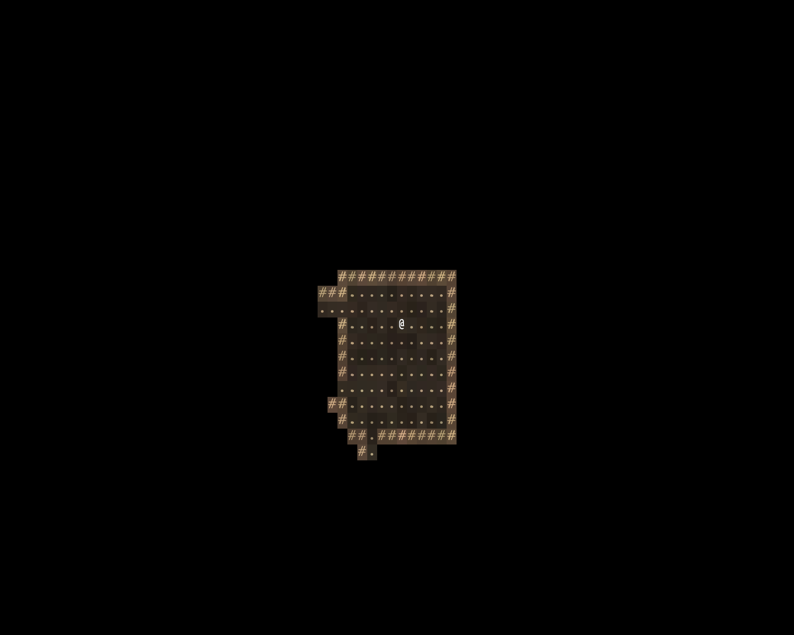

# A map on screen

> Run it: `cargo run -p tutorial --bin step01_a_map`
>
> Source: [`step01_a_map.rs`](https://github.com/rudehn/rl-engine/blob/main/examples/tutorial/src/bin/step01_a_map.rs)

Generate a dungeon floor, hand it to the engine, draw it from the player's point of view.
Nothing moves yet.



## The app

<!-- include: ../../../examples/tutorial/src/bin/step01_a_map.rs:main -->
```rust,no_run
fn main() -> AppExit {
    let mut app = App::new();
    // What every game adds: the window and the glyph terminal, the turn
    // loop, sight, the map across the whole terminal, and the UI base.
    app.add_plugins(RoguelikePlugins::new("Warren", COLS, ROWS)).insert_resource(Seed(RunSeed(7))).add_systems(NewRun, start);
    app.run()
}
```

`RoguelikePlugins` is what every game adds, in one line.
It opens a window sized to an 80 by 40 cell glyph terminal and adds the plugins no game goes without:

- `TerminalPlugin`, the glyph grid, one Bevy sprite per cell. Nothing about it is roguelike; every other drawing plugin writes into it.
- `CorePlugin`, the engine: the turn loop, the clock, the occupancy index, the map and its places, the `EngineState` machine, and three actions that need nothing else (step, wait, go through).
- `FovPlugin`, which computes what each actor can see. The map view draws a tile only if the player's `Viewshed` says it is visible or the explored map says it was.
- `MapViewPlugin`, the map, drawn across the whole terminal unless `.map(rect)` gives it less.
- `ParticlesPlugin`, what flies and bursts over the map for a moment after a turn.
- `UiPlugin`, the base every panel in [chapter 3](03-what-the-player-knows.md) onward needs.

Two more come along that a game never calls: `ReplayPlugin`, which writes a run down and plays it back when `RL_RECORD` or `RL_REPLAY` names a file, and `CapturePlugin`, which photographs the window and is how this guide's screenshots are made.

Everything else is a plugin you name, starting in [chapter 4](04-monsters.md), and nothing turns itself on because a resource happens to exist.
The group is Bevy's own kind, so any part of it can be swapped or switched off.
Leave out the `WorldMap` and play refuses to begin, listing everything missing at once with how to make each.

Two lines beside it carry the rest of a run.
`Seed` is where all randomness comes from: every stream the engine draws on is derived from it, so the same number always builds the same warren, and [chapter 7](07-down-the-stairs.md) takes it off the command line.
`NewRun` is the schedule that starts a run, and the engine runs it again on a restart with the old run torn down first, which is why a game's setup goes there rather than in Bevy's `Startup`.

## Tiles are ids

<!-- include: ../../../examples/tutorial/src/bin/step01_a_map.rs:tiles -->
```rust,no_run
/// The warren's tiles, and how each one looks in full light.
struct Warren {
    tiles: TileRegistry,
    seed: RunSeed,
}

impl Warren {
    fn new(seed: RunSeed) -> Self {
        let mut tiles = TileRegistry::new();
        tiles.register(TileProps::wall("earth")).unwrap();
        tiles.register(TileProps::floor("dirt")).unwrap();
        Self { tiles, seed }
    }

    /// Both colours of every tile, and how much each cell jitters from
    /// its neighbours. The renderer derives darkness and memory from these.
    fn appearance(&self) -> TileAppearance {
        let mut look = TileAppearance::new();
        let t = |name| self.tiles.expect(name);
        look.set_varied(t("earth"), Cell::new('#', Color::srgb(0.78, 0.66, 0.50)).on(Color::srgb(0.34, 0.27, 0.21)), Vary::new(0.20, 0.05));
        look.set_varied(t("dirt"), Cell::new('.', Color::srgb(0.66, 0.58, 0.45)).on(Color::srgb(0.18, 0.15, 0.12)), Vary::new(0.28, 0.06));
        look
    }
}
```

`register` returns a dense `TileId`; `expect` looks one up by name and panics if it is missing.
The engine knows whether a tile is walkable and whether it blocks sight, and nothing else.
There is no `Tile::Wall` to extend, so lava, glass or a tile only ghosts can cross needs no engine change.

`TileAppearance` holds what each id looks like in full light.
Both colours are authored because light multiplies them channel by channel and memory fades them.
`Vary` jitters each cell's colour by a hash of its position, so the floor is not graph paper.
Three tiles are fine to write out like this.
When the warren gains its bestiary in [chapter 8](08-content-in-files.md), the looks move into a file beside it, and `TileAppearance::load` reads them.

## The floor is a chain of passes

<!-- include: ../../../examples/tutorial/src/bin/step01_a_map.rs:rules -->
```rust,no_run
/// How a floor is built. The engine calls this once, the first time
/// something enters the map, and keeps what comes back.
impl PlaceRules for Warren {
    fn build(&self, _: MapId, _: Option<&WorldGraph>) -> Result<PlaceBuild, BuildError> {
        let (wall, floor) = (self.tiles.expect("earth"), self.tiles.expect("dirt"));
        let mut ctx = BaseContext::blank(84, 42, self.tiles.clone(), wall);
        Chain::new()
            .then(dungeon::Rooms { floor, attempts: 40, min_size: 5, max_size: 10, min_rooms: 6 })
            .then(dungeon::RandomStart)
            .run(&mut ctx, self.seed)?;
        PlaceBuild::from_context(ctx)
    }
}
```

`PlaceRules::build` is called once, the first time anything enters that map, and the result is kept for the run.

`Rooms` carves rectangles and joins them with corridors.
`RandomStart` picks a floor cell and reports it as the chain's start point.
Each pass keys its own random stream off its name, so adding a pass later does not shift the numbers an earlier pass draws.

`PlaceBuild::from_context` reads the finished chain: the start point becomes the entry, an exit point becomes the exit if some pass emitted one, and prefab marks become spots to populate.
It fails if no pass emitted a start.

## Handing it over

<!-- include: ../../../examples/tutorial/src/bin/step01_a_map.rs:start -->
```rust,no_run
/// Hands the engine the map rules and the player, then warps the player in.
fn start(mut commands: Commands, seed: Res<Seed>, mut warps: MessageWriter<WarpRequest>, mut next: ResMut<NextState<EngineState>>) {
    let warren = Warren::new(seed.0);
    commands.insert_resource(warren.appearance());
    commands.insert_resource(WorldMap::new(warren.tiles.tables()));
    commands.insert_resource(PlaceRulesRes(Box::new(warren)));

    let player =
        commands.spawn(((Actor, Player, Blocks, Position(Point::ZERO)), (Viewshed::new(9), RevealsMap, Glyph::new('@', Color::WHITE).on_layer(10)))).id();
    warps.write(WarpRequest::into_place(player, WARREN));
    next.set(EngineState::Playing);
}
```

`WorldMap::new` takes the tile tables alone.
No world graph, no region size, no surface: a game with an overworld adds those, a delve never names them.

The player is components, not a class.
`Actor` takes turns, `Player` is the one the loop waits on for input, `Blocks` puts it in the occupancy index, `RevealsMap` marks whose sight fills in the explored map.

Map zero is the streamed surface, which Warren has none of, so its one floor is map one.
`WarpRequest::into_place` puts the player there, which triggers the build.
The engine's system sets do not run outside `EngineState::Playing`, which is what lets a title screen exist.

## Try it

- Change `Viewshed::new(9)` to `4` and watch the room close in.
- Change the seed, then change it back and confirm you get the same floor.
- Register a third tile and add `.then(passes::Scatter { name: "rubble", tile: rubble, on: floor, chance_pct: 6 })`.

Next: [walking](02-walking.md).
