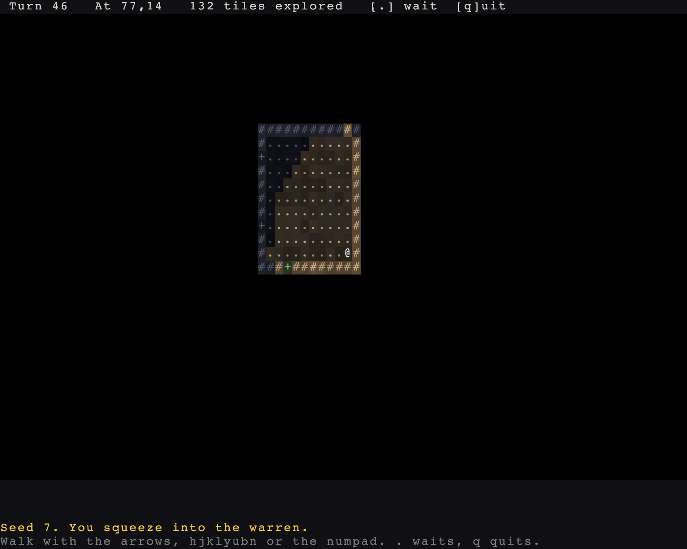

# What the player knows

> Run it: `cargo run -p tutorial --bin step03_sight`
> Source: [`step03_sight.rs`](https://github.com/rudehn/rl-engine/blob/main/examples/tutorial/src/bin/step03_sight.rs)



## Walkable and opaque are separate flags

```rust
        tiles.register(TileProps::floor("roots").opaque(true)).unwrap();
```

Which is what makes doors possible.
Adding `Doors` to the chain puts one in every corridor mouth:

```rust
            .then(dungeon::Doors { door: self.tiles.expect("roots") })
```

Field of view reads opacity off the tile tables through an `OpacitySource`, so a tile you invented five minutes ago blocks sight correctly.

## Seen, and once seen

`Viewshed` carries two bit grids:

- `line` is every tile with an unobstructed line to it.
- `visible` is what the actor actually sees.

They are the same set until you turn lighting on, when `visible` shrinks to what is lit, within dark sight, or adjacent.
Warren stays in daylight and never notices.

`Knowledge` is the explored map, kept per map id and filled by whoever carries `RevealsMap`.
It is a resource, not a component: the player's map is the game's map.
Going down a floor does not clear it.

The map view combines the three: visible tiles in their authored colours, explored-but-unseen run through `Memory`, everything else blank.
The cold blue in the screenshot is not a colour anyone chose. It is the brown floor, remembered.

## The status line and the log

```rust,no_run
    app.add_plugins(RoguelikePlugins::new("Warren", COLS, ROWS).map(Rect::new(0, 1, COLS, ROWS - 1 - LOG_ROWS)))
    // Two panels: the vitals strip on the top row, the log along the
    // bottom. Each draws itself; neither needs a system of yours.
    .add_plugins(VitalsPanel::new(Rect::new(0, 0, COLS, 1)).hints("[.] wait  [q]uit"))
    .add_plugins(LogPanel::new(Rect::new(0, ROWS - LOG_ROWS, COLS, LOG_ROWS)))
```

`.map` gives the map everything but the top row and the log, which leaves room for two panels.
A panel is a plugin holding the rectangle it draws in, the way the map view does.
`VitalsPanel` reads health, armor, the turn and the position off the player and prints them; `LogPanel` prints the log.
Neither needs a system of yours, and neither is added for you: [chapter 10](10-panels.md) is the rest of them and the reason they are split the way they are.

The one thing the strip cannot know is how much of the map is yours, so Warren tells it:

```rust,no_run
{{#include ../../../examples/tutorial/src/bin/step03_sight.rs:status}}
```

That is a facet: a note pushed onto the view in `ViewSet::Annotate`, in words the engine could not have written.

Drawing is layered by `PresentSet`: `Narrate`, `Map`, `Chrome`, `Overlay`.
You work out what to say in `Narrate`; the map is painted under it, chrome over it, modals over everything.
No crate orders itself after another crate's draw function.

The log takes a tone rather than a colour, so the palette decides what bad news looks like.

## Try it

- Register `TileProps::wall("glass")` without `opaque`, scatter it, look through a wall.
- Drop `RevealsMap` and watch the world go dark one step behind you.
- Print `line.count()` next to `visible.count()`, then turn lighting on later and watch them come apart.
