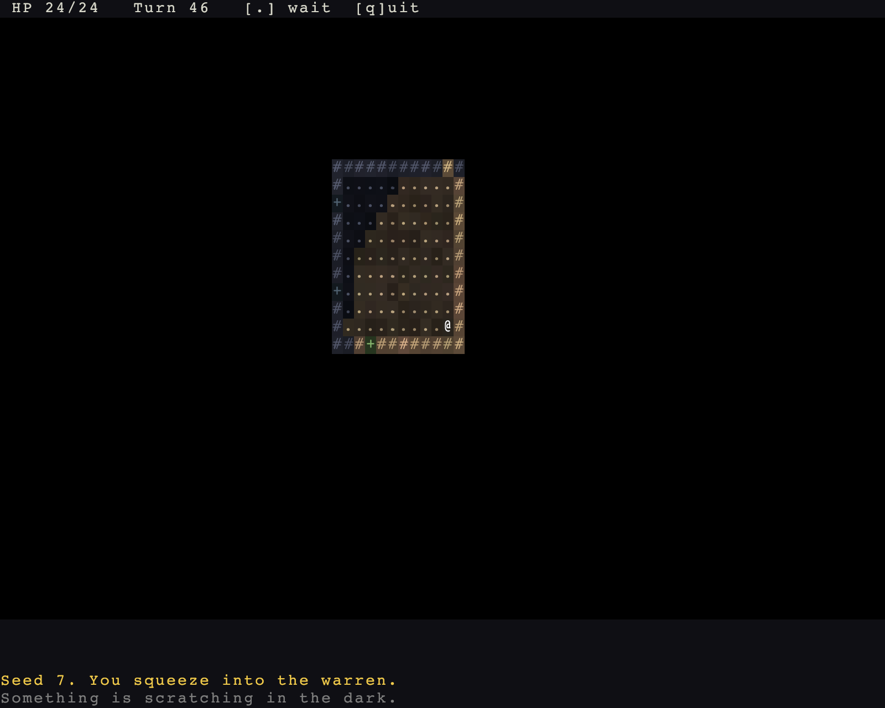

# Things to carry, throw and eat

> Run it: `cargo run -p tutorial --bin step04_things`
>
> Source: [`step04_things.rs`](https://github.com/rudehn/rl-engine/blob/main/examples/tutorial/src/bin/step04_things.rs)

<div class="demo" data-demo="step04_things">
  
  <button type="button">Play this step</button>
  <p class="weight">Loads about 8 MB</p>
</div>

Bread that mends, rocks that fly, and monsters clever enough to use both.

## An item is components

<!-- include: ../../../examples/tutorial/src/bin/step04_things.rs:litter -->
```rust,no_run
/// What the floor is littered with: bread that mends, rocks that fly.
fn litter(commands: &mut Commands, rats: &Rats, p: Point, bread: bool) {
    if bread {
        commands.spawn((Item, Crust(8), Name::new("a crust of bread"), Position(p), Glyph::new('%', Color::srgb(0.85, 0.72, 0.40)).on_layer(2)));
    } else {
        commands.spawn((
            Item,
            Throwable { range: 7, strike: Some((rats.bite, DiceRoll::new(1, 4))) },
            Name::new("a rock"),
            Position(p),
            Glyph::new('*', Color::srgb(0.66, 0.66, 0.70)).on_layer(2),
        ));
    }
}
```

`Item` says the engine may move it between the ground, a bag and a slot.
`Position` means it is lying on the floor; picking it up removes that component and dropping it puts one back.
`Crust(8)` is yours, and the engine has no opinion about it.

`Throwable` is the engine's, and it carries the two facts a throw needs: how far it reaches, and what it does to whoever it hits.
A throw is both an item and a blow, so it is its own plugin: the rock leaves the bag the way a dropped one does, and whoever it strikes is hurt down the same damage pipeline a bite goes down.

## Keys, and a cursor you did not write

<!-- include: ../../../examples/tutorial/src/bin/step04_things.rs:input -->
```rust,no_run
/// The player, but only while it is holding the turn, and what it carries.
type PlayerTurn<'w, 's> = Query<'w, 's, (Entity, &'static Inventory), (With<Player>, With<MyTurn>)>;

/// Keys to intents. Writing an intent is the whole of asking to act: the
/// engine claims the turn, charges it, and refuses what cannot be done.
///
/// The walk keys write a [`Bump`], which the engine resolves to a step, a
/// blow at a foe, or opening a door, whichever is in the way. `r` writes no
/// intent at all: it opens the engine's aiming cursor, and the throw is
/// written when the cursor is committed.
fn player_input(keys: Res<ButtonInput<KeyCode>>, dirs: Res<DirectionKeys>, player: PlayerTurn, carried: Carried, mut intents: PlayerIntents) {
    if keys.just_pressed(KeyCode::KeyQ) {
        intents.exit.write(AppExit::Success);
        return;
    }
    // No turn in hand means it is somebody else's move; the key is dropped.
    let Ok((entity, bag)) = player.single() else { return };
    if let Some(dir) = dirs.just_pressed(&keys) {
        intents.bumps.write(Intent::new(entity, Bump(dir)));
    } else if keys.just_pressed(KeyCode::KeyG) {
        intents.pick_ups.write(Intent::new(entity, PickUp));
    } else if keys.just_pressed(KeyCode::KeyE) {
        if let Some(crust) = bag.items.iter().copied().find(|i| carried.crusts.contains(*i)) {
            intents.uses.write(Intent::new(entity, UseItem(crust)));
        }
    } else if keys.just_pressed(KeyCode::KeyR) {
        if let Some(rock) = bag.items.iter().copied().find(|i| carried.rocks.contains(*i)) {
            intents.aims.write(AimThrow { user: entity, item: rock });
        }
    } else if keys.just_pressed(KeyCode::Period) || keys.just_pressed(KeyCode::Numpad5) {
        intents.waits.write(Intent::new(entity, Wait));
    }
}
```

`g` and `e` write intents, the same as walking does.
`r` writes no intent at all.
It writes an `AimThrow`, and the engine opens its targeting cursor, previews the flight with the same function the resolver throws with, and writes the throw when you commit.
The cells you are shown are the cells the rock will fly through.

Eating is the pattern worth keeping.
`UseItem` checks the item is in the bag, spends the turn and writes `ItemEvent::Used`.
It does not heal, teleport or explode; what eating a crust means is the game's:

<!-- include: ../../../examples/tutorial/src/bin/step04_things.rs:eat -->
```rust,no_run
/// What eating a crust means. The engine has already spent the turn and
/// taken the item out of the bag; this is the part only the game knows.
///
/// It runs in [`TurnSet::React`], inside the turn, so the healing lands
/// before the next rat is dealt its move. In the drawing phase it would
/// land a blow too late.
fn eat(mut commands: Commands, mut used: MessageReader<ItemEvent>, crusts: Query<&Crust>, mut eaters: Query<&mut Health>) {
    for ev in used.read() {
        let ItemEvent::Used { actor, item } = *ev else { continue };
        let (Ok(crust), Ok(mut health)) = (crusts.get(item), eaters.get_mut(actor)) else { continue };
        health.current = (health.current + crust.0).min(health.max);
        commands.entity(item).despawn();
    }
}
```

That runs in `TurnSet::React`, inside the turn, so the healing lands before the next rat is dealt its move.
In the drawing phase it would land a blow too late.

## How clever a monster is

<!-- include: ../../../examples/tutorial/src/bin/step04_things.rs:populate -->
```rust,no_run
/// Fills the floor the one time it is built. `PlaceEntered::first` is
/// true only on that arrival, so coming back does not restock it.
fn populate(mut commands: Commands, mut entered: MessageReader<PlaceEntered>, rats: Res<Rats>, map: Res<WorldMap>, seed: Res<Seed>) {
    for ev in entered.read() {
        if !ev.first {
            continue;
        }
        let Some(place) = map.place(ev.map) else { continue };
        let bounds = place.terrain.bounds();
        // A stream of its own, keyed by name: adding another spawner later
        // cannot shift the numbers this one draws.
        let mut rng = seed.stream(b"warren.rats", ev.map.0 as u64);
        let mut placed = 0;
        while placed < 16 {
            let p = Point::new(rng.random_range(bounds.x..bounds.right()), rng.random_range(bounds.y..bounds.bottom()));
            // Not on top of the player, and not close enough to be unfair.
            if !map.is_walkable(p) || geometry::chebyshev(p, ev.entry) < 8 {
                continue;
            }
            // Every fourth is a ratling: the same body, a better mind.
            let clever = placed % 4 == 3;
            let mut e = commands.spawn((
                (Actor, Blocks, Position(p), Speed(110), Faction(rats.faction)),
                (Health::full(6), Armor(0), Perception(7), DarkSight(9)),
                (MeleeAttack { kind: rats.bite, dice: DiceRoll::new(1, 3) },),
            ));
            if clever {
                e.insert((
                    Mind(rats.ratling.clone()),
                    // Wits are what a mind is allowed to consider. A ratling
                    // opens doors, fetches what it can throw, and throws it.
                    Intelligence(Wits::SAPIENT),
                    Inventory::default(),
                    Glyph::new('R', Color::srgb(0.85, 0.66, 0.50)).on_layer(5),
                    Name::new("ratling"),
                ));
            } else {
                e.insert((
                    Mind(rats.mind.clone()),
                    // An animal flees and searches, and that is all.
                    Intelligence(Wits::ANIMAL),
                    Glyph::new('r', Color::srgb(0.72, 0.55, 0.45)).on_layer(5),
                    Name::new("rat"),
                ));
            }
            placed += 1;
        }
        // Bread to mend with and rocks to throw, scattered the same way.
        let mut dropped = 0;
        while dropped < 14 {
            let p = Point::new(rng.random_range(bounds.x..bounds.right()), rng.random_range(bounds.y..bounds.bottom()));
            if !map.is_walkable(p) {
                continue;
            }
            litter(&mut commands, &rats, p, dropped % 2 == 0);
            dropped += 1;
        }
    }
}
```

`Intelligence` is a set of wits, and it decides what a mind is allowed to consider.
`Wits::MINDLESS` fights to the death and forgets what it cannot see.
`Wits::ANIMAL` flees when hurt and searches where it last saw you, and that is all a rat is.
`Wits::SAPIENT` adds opening doors, picking things up, wearing them and throwing them, which is what makes a ratling worth being afraid of.

The tactics come from the same list either way.
A ratling's brain has `ThrowAtRange` above `Hunt`, so it stops and throws when it has something to throw and you are not already at its elbow, and `Scavenge`, so it will walk a few steps out of its way to fetch a rock it can throw later.
Wits are the gate: `Scavenge` will not fetch what its wits say it can never use.

## Try it

- Give the rats `Wits::SAPIENT` and watch a rock come back at you.
- Drop `Scavenge` from the ratling brain and see how much less dangerous a stocked floor becomes.
- Give the crust a `Stack { key, count }`, drop six in one cell, and pick them all up at once.

Next: [a knack of your own](05-a-knack.md).
