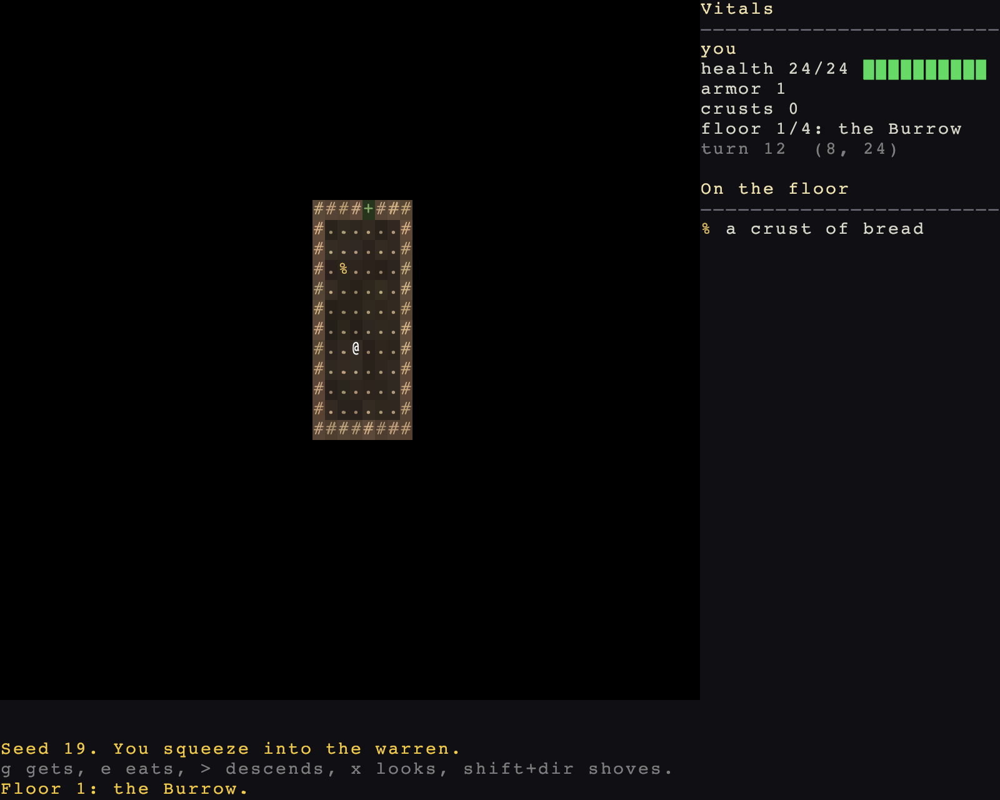

# Two floors, and a way out

> Run it: `cargo run -p tutorial --bin step06_descent`
>
> Source: [`step06_descent.rs`](https://github.com/rudehn/rl-engine/blob/main/examples/tutorial/src/bin/step06_descent.rs)

<div class="demo" data-demo="step06_descent">
  
  <button type="button">Play this step</button>
  <p class="weight">Loads about 8 MB</p>
</div>

Stairs down, a second floor built a different way, and daylight that ends the run.

## A place is a map that is kept

<!-- include: ../../../examples/tutorial/src/bin/step06_descent.rs:floors -->
```rust,no_run
/// How deep the warren goes before it lets you out again.
const FLOORS: u32 = 2;

/// Map zero is the streamed surface, which the warren has none of, so its
/// floors are maps one upward.
fn map_of(floor: u32) -> MapId {
    MapId(floor)
}

/// The floor a map id is.
fn floor_of(map: MapId) -> u32 {
    map.0
}

/// What a floor is called.
fn name_of(floor: u32) -> &'static str {
    match floor {
        1 => "the Burrow",
        _ => "the Deep Nest",
    }
}
```

Map zero is the streamed surface, which the warren has none of, so its floors are maps one upward.

Everything above zero is a *place*: built the first time it is entered, then kept.
Leaving freezes the actors and items where they stand, so the rat you ran from is still in the corridor at the health you left it.
Actors on other maps are skipped by the scheduler instead of simulated, so a deep run costs no more per turn than a shallow one.

## One rules object, two floors

<!-- include: ../../../examples/tutorial/src/bin/step06_descent.rs:rules -->
```rust,no_run
/// How a floor is built. The engine calls this once, the first time
/// something enters the map, and keeps what comes back.
impl PlaceRules for Warren {
    fn build(&self, map: MapId, _: Option<&WorldGraph>) -> Result<PlaceBuild, BuildError> {
        let depth = floor_of(map);
        let (wall, open, roots) = (self.tiles.expect("earth"), self.tiles.expect("dirt"), self.tiles.expect("roots"));
        let mut ctx = BaseContext::blank(84, 42, self.tiles.clone(), wall);
        // A stream per floor, so the second floor is the same whether or
        // not you dawdled on the first.
        let seed = RunSeed(self.seed.0 ^ (depth as u64) << 32);
        let chain = match depth {
            // Dug rooms near the surface.
            1 => Chain::new().then(dungeon::Rooms { floor: open, attempts: 40, min_size: 5, max_size: 10, min_rooms: 6 }).then(dungeon::Doors { door: roots }),
            // Gnawed-out caves under them.
            _ => Chain::new().then(passes::CellularCave { wall, floor: open, fill_pct: 45, ..Default::default() }).then(passes::KeepLargestRegion { wall }),
        };
        // Every floor gets a start and a point as far from it as the floor
        // allows: the stairs down on the first, the way out on the second.
        chain.then(dungeon::RandomStart).then(dungeon::FarthestExit).run(&mut ctx, seed)?;
        PlaceBuild::from_context(ctx)
    }
}
```

`build` is handed the `MapId`, so the shape of the run is a `match`.
Dug rooms near the surface, a gnawed-out cave under them, and `KeepLargestRegion` after the cave because cave generators produce islands and an unreachable half is a floor whose stairs are sometimes unreachable.

The seed is derived per floor, so the second floor is the same whether or not you dawdled on the first.
Derive from the run seed and the thing being built, never from a counter the player can move.

## Stairs are entities

<!-- include: ../../../examples/tutorial/src/bin/step06_descent.rs:populate -->
```rust,no_run
/// Fills the floor the one time it is built. `PlaceEntered::first` is
/// true only on that arrival, so coming back does not restock it.
fn populate(mut commands: Commands, mut entered: MessageReader<PlaceEntered>, rats: Res<Rats>, map: Res<WorldMap>, seed: Res<Seed>) {
    for ev in entered.read() {
        if !ev.first {
            continue;
        }
        let Some(place) = map.place(ev.map) else { continue };
        let bounds = place.terrain.bounds();
        // A stream of its own, keyed by name: adding another spawner later
        // cannot shift the numbers this one draws.
        let mut rng = seed.stream(b"warren.rats", ev.map.0 as u64);
        let mut placed = 0;
        while placed < 16 {
            let p = Point::new(rng.random_range(bounds.x..bounds.right()), rng.random_range(bounds.y..bounds.bottom()));
            // Not on top of the player, and not close enough to be unfair.
            if !map.is_walkable(p) || geometry::chebyshev(p, ev.entry) < 8 {
                continue;
            }
            // Every fourth is a ratling: the same body, a better mind.
            let clever = placed % 4 == 3;
            // A ratling carries its own supper. Nothing picks bread up off
            // the floor: `Scavenge` fetches gear and missiles, not meals.
            let supper = clever.then(|| {
                commands
                    .spawn((
                        Item,
                        Crust(6),
                        Tagged(vec![rats.bread]),
                        Name::new("a crust of bread"),
                        Glyph::new('%', Color::srgb(0.85, 0.72, 0.40)).on_layer(2),
                    ))
                    .id()
            });
            let mut e = commands.spawn((
                (Actor, Blocks, Position(p), Speed(110), Faction(rats.faction)),
                (Health::full(6), Armor(0), Perception(7), DarkSight(9)),
                (MeleeAttack::new(rats.bite, DiceRoll::new(1, 3)),),
            ));
            if clever {
                e.insert((
                    Mind(rats.ratling.clone()),
                    // Wits are what a mind is allowed to consider. A ratling
                    // opens doors, fetches what it can throw, and throws it.
                    Intelligence(Wits::SAPIENT),
                    Inventory { items: supper.into_iter().collect() },
                    Grants(vec![rats.gnaw]),
                    Glyph::new('R', Color::srgb(0.85, 0.66, 0.50)).on_layer(5),
                    Name::new("ratling"),
                ));
            } else {
                e.insert((
                    Mind(rats.mind.clone()),
                    // An animal flees and searches, and that is all.
                    Intelligence(Wits::ANIMAL),
                    Glyph::new('r', Color::srgb(0.72, 0.55, 0.45)).on_layer(5),
                    Name::new("rat"),
                ));
            }
            placed += 1;
        }
        // Stairs down while there is a floor below, and the way out on the
        // last one. Both are entities standing on a cell, nothing more.
        let depth = floor_of(ev.map);
        let stone = Color::srgb(0.80, 0.80, 0.86);
        if let Some(far) = ev.exit {
            if depth < FLOORS {
                commands.spawn((
                    Position(far),
                    Transition { to: Destination::Place { map: map_of(depth + 1), arrive: Arrive::Entry } },
                    Name::new("stairs down"),
                    Glyph::new('>', stone).on_layer(1),
                ));
            } else {
                commands.spawn((Position(far), WayOut, Name::new("a crack of daylight"), Glyph::new('<', Color::srgb(1.0, 0.95, 0.70)).on_layer(1)));
            }
        }
        // Bread to mend with and rocks to throw, scattered the same way.
        let mut dropped = 0;
        while dropped < 14 {
            let p = Point::new(rng.random_range(bounds.x..bounds.right()), rng.random_range(bounds.y..bounds.bottom()));
            if !map.is_walkable(p) {
                continue;
            }
            litter(&mut commands, &rats, p, dropped % 2 == 0);
            dropped += 1;
        }
    }
}
```

There is no stairs table and no special tile flag.
A `Transition` names where it leads and how you arrive, and `GoThrough` takes the one you are standing on.
Nothing stops you putting one on a rat.

## Winning

<!-- include: ../../../examples/tutorial/src/bin/step06_descent.rs:way_out -->
```rust,no_run
/// The crack of daylight on the last floor. Standing on it ends the run.
#[derive(Component, Clone, Copy)]
struct WayOut;

/// Winning is a component and an `if`. It runs inside the turn, so the run
/// ends on the step that reached the daylight and not a frame later.
fn leave(player: Query<(&Position, Option<&OnMap>), With<Player>>, ways: Query<(&Position, Option<&OnMap>), With<WayOut>>, mut over: MessageWriter<RunOver>) {
    let Ok((at, on)) = player.single() else { return };
    for (way, way_on) in &ways {
        if way.0 == at.0 && way_on.map(|m| m.0) == on.map(|m| m.0) {
            over.write(RunOver::won().saying("You come up into the roots, and the scratching stays below."));
        }
    }
}
```

A victory condition is a component and an `if`.
`RunOver::won()` ends the run the way the player's death does: the menu opens over the last frame with Warren's words above it, and no way back into it.

It runs inside the turn, so the run ends on the step that reached the daylight rather than a frame later.
[Where to go next](09-where-to-go-next.md) points at the quest system, which is this with the objectives in a file.

## Try it

- Add a third floor. You should only touch `FLOORS`, `name_of` and the `match`.
- Put a one-way `Transition` back to the first floor at the bottom.
- Go down, kill a rat, come back up, go down again. The rat stays dead.

Next: [content in files](07-content-in-files.md).
