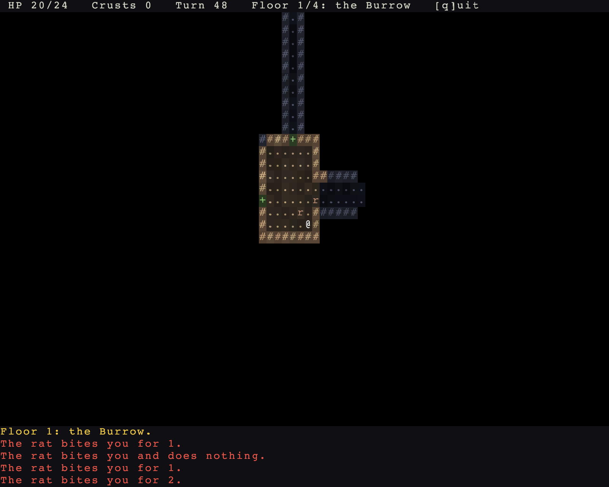

# Introduction

This guide builds a roguelike called Warren: a rat warren under a granary, four floors deep, with a rat king at the bottom whose death ends the run.



Ten steps, each a complete program you can run. CI compiles every one of them, so the code in these pages is code that builds.

```sh
cargo run -p tutorial --bin step01_a_map
cargo run -p tutorial --bin step10_panels
```

## Two rules the API follows

**Own the loop or leave it out.**
The engine holds the turn loop, the scheduler, field of view, the occupancy index, the damage pipeline and the map.
Your game supplies the decisions: what a tile looks like, what a monster wants, what eating a crust means.

**The engine never names your content.**
There is no `enum MonsterKind`, no `Tile::Wall`, no `DamageType::Fire`.
Tiles, damage kinds, factions, statuses and quests are opaque ids in registries you fill.

## What you need first

Rust, and Bevy's ECS: components, systems, resources, `Query`, `Commands`.
Not Bevy's renderer, assets or scenes.
Warren draws with a glyph terminal the engine ships.

## How the chapters work

Each chapter takes the previous step and adds one thing.
Code in the text is pulled from the step's source, and the full file is linked at the top of every chapter.

Read it through and build Warren as you go.
Or go to [getting set up](00-getting-set-up.md), generate a game of your own from the template, and use the chapters as the reference for whatever you add next.
Or read the finished game first: [step 10](10-panels.md) is all of Warren in one file.

Next: [getting set up](00-getting-set-up.md).
